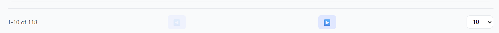
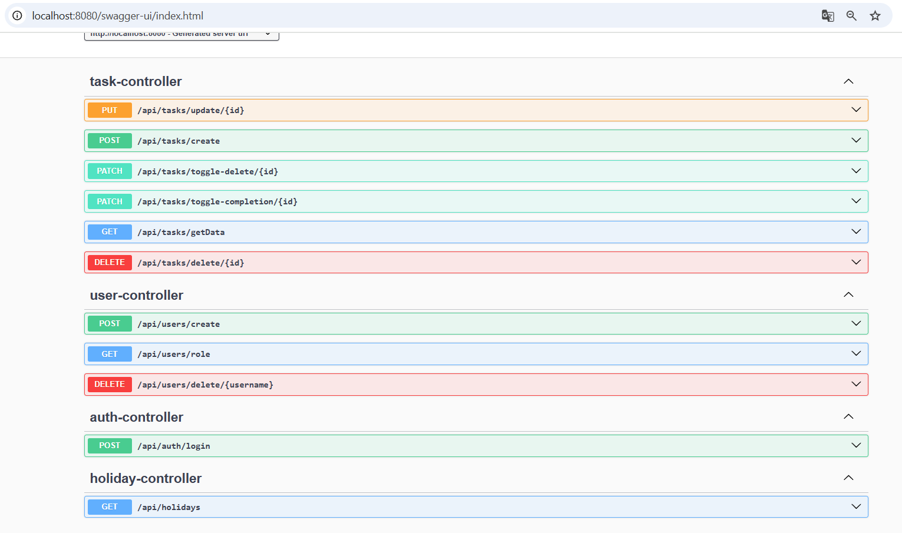

# 📝 Task Management System

This project was developed within **3 days** as part of a technical assessment for a Tech Lead role.
A full-stack task management system built with **Angular**, **TypeScript**, **Spring Boot (Java)**, and **PostgreSQL**, fully containerized using **Docker Compose**.

## 🚀 Features

* Create, update, delete, and view tasks
* Filter tasks by priority and due date
* Mark tasks as completed
* Prevent creation on public holidays (via Nager.Date API)
* Undo changes (soft delete)
* Role-based access control (admin/validator/user permissions)
* Responsive and user-friendly UI

## Architecture

The app is structured into three main containers:

| Container | Stack                    |
| --------- | ------------------------ |
| UI        | Angular + TypeScript     |
| Backend   | Spring Boot + Java       |
| Database  | PostgreSQL               |

All services are managed using Docker Compose.


---

## 🛠️ How to Run the Project

### 1. Clone the repository

```bash
git clone https://github.com/your-username/task-manager.git
cd task-manager
```

### 2. Build and run using Docker Compose

```bash
docker-compose up --build
```

This will start the frontend on `http://localhost:4200` and the backend on `http://localhost:8080`.

> Make sure Docker is installed and running on your system.

### 3. Access the Application

* **Frontend**: [http://localhost:4200](http://localhost:4200)
* **Backend API**: [http://localhost:8080/api/tasks](http://localhost:8080/api/tasks)

---

## 🔐 User Roles

* **Admin / Validator**: Can delete or restore tasks
* **Regular Users**: Can create/update their own tasks

---

## 🧪 Testing

⚠️ Note: Due to the time constraint for the assessment, unit tests were not implemented. However, the codebase is modular and test-ready for future enhancements.

* Frontend: `ng test`
* Backend: `mvn test`

---

## 📆 Tech Stack

* **Frontend**: Angular, TypeScript, SCSS
* **Backend**: Spring Boot, Java 17
* **Database**: PostgreSQL
* **DevOps**: Docker, Docker Compose
* **API Integration**: Nager.Date (Public holidays)

---

## 🧱 Screenshots & Feature Walkthrough

### Login Page


* Users must log in to access the system.
* Signup is currently marked as "Coming Soon".

### Create a Task


* Fill in title, description, priority, and due date.
* Creation is disabled for public holidays.

### Task List Display


* Tasks are displayed in a sortable table.
* Each task can be edited, marked as done, or deleted (if user has permissions).

### Completed Task View


* Toggled checkbox indicates task completion.

### Filters


* Filter tasks by priority or due date.
* Clear filters easily.

### Pagination




* Pagination to navigate through large number of tasks.
* User can choose number of items per page. (10 / 50 / 100)

### Public Holiday Handling


* Due date input prevents selection of public holidays via integration with Nager.Date API.

### Current Task Actions


* Users can update ✏️ or soft delete 🗑️ tasks.

### Admin Deleted View


* A separate tab shows deleted tasks.

### Deleted Task Actions (Admin Only)


* Admins and Validators can either restore ↩️ or permanently delete 💀 tasks.
* Regular users can only restore ↩️ their own deleted tasks.


### Logout


* User can logout from header.

### API Documentation



* Swagger auto-documentation for backend REST APIs.

---

## 🙌 Credits

Designed and developed by Sofiane.
